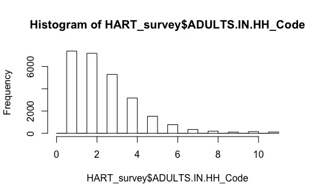

# Analyzing Survey Data in R Studio

**Author:** Victoria Larson

__*Project Description:*__
*In this project I will be taking Honolulu Authority for Rapid Transportation Survey Data and would like to analyze and manipulate the data in R. This project is designed to gain a better understanding of R so I may use it in future projects.*

See HART_surveyscript.R for my work

Here are some questions I had about my data while working in R.

**Create a Histogram showing the number of adults per household**

**Q: How many females took the survey?**

*Answer:* 13974

**Q: How many males took the survey?**

*Answer:* 12272
